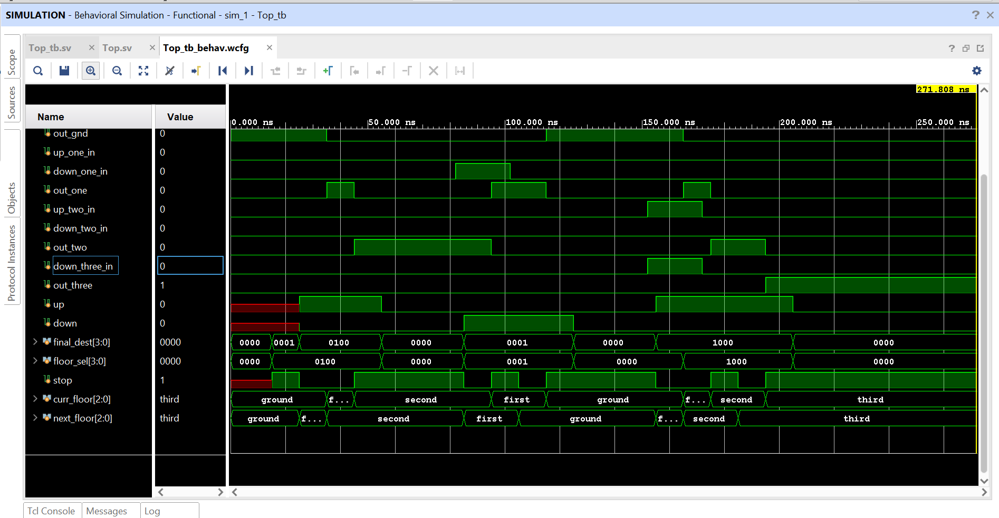

# Elevator controller

## Project Description

The **Elevator FSM Project** is a digital simulation of a 4-floor elevator (lift) controller implemented in **SystemVerilog**. 
This project models a real-world lift that moves up and down, responds to floor requests from passengers, 
and efficiently serves multiple simultaneous requests.

**Features:**
- **4 Floors:** Ground, First, Second, Third (Top Floor) 
- **Floor Requests:** Handles requests from passengers inside the lift (`floor_sel_in`) and from floor buttons (`up_*_in` and `down_*_in`).
- **Directional Control:** Determines whether the lift should move **up** or **down** based on current requests. 
- **Request Handling:**  
  - Local requests (buttons inside the lift)  
  - External requests (up/down buttons on each floor)  
- **Request Clearance:** Once the lift reaches a floor and stops, the corresponding request is cleared automatically.
- **Final Destination Logic:** Uses a combinational block to calculate the next floor to serve (`final_dest`) according to the requested direction, 
  ensuring the lift serves the highest or lowest floor in the current direction.
- **Outputs:**
    - Provides signals (`out_gnd`, `out_one`, `out_two`, `out_three`) that indicate the current lift position.
    - The lift stops for 2 clock cycles if it opens and closes doors and 1 clock cycle if that floor is just an intermediate step.
- **Reset Support:** Resets lift to ground floor and clears all requests  

This project demonstrates **Finite State Machine (FSM) design**, combinational logic for destination calculation, and sequential logic for state updates. 
It is beginner-friendly, easy to understand, and can be extended to more floors, advanced scheduling algorithms, or door control systems.

---

## How It Works

- **Floor Requests:** When a floor button is pressed, the corresponding `floor_sel` bit or `up_*_in` / `down_*_in` is set.  
- **Final Destination:** A combinational block computes `final_dest` based on the current requests and lift direction.  
- **Movement:** The lift moves **up** or **down** towards `final_dest`.  
- **Request Clearance:** Once the lift reaches a floor and stops, the served request is cleared automatically.  
- **Outputs:** `out_*` signals indicate the current lift position.

---

## Testbench

The project includes a beginner-friendly testbench (`Top_tb`) that demonstrates:  

1. Moving from **Ground → Second Floor**  
2. Moving from **First → Ground Floor**  
3. Handling **multiple requests simultaneously**  

The testbench prints the lift’s current floor at each step and simulates button presses using `floor_sel_in` and `up_*_in` / `down_*_in`.

---

## Simulation Output Example



```bash
Time=0 | out_gnd=1 out_one=0 out_two=0 out_three=0\n
Test 1: Ground → Second Floor
Time=35000 | out_gnd=0 out_one=1 out_two=0 out_three=0
Time=45000 | out_gnd=0 out_one=0 out_two=1 out_three=0
Test 2: First → Ground Floor
Time=95000 | out_gnd=0 out_one=1 out_two=0 out_three=0
Time=115000 | out_gnd=1 out_one=0 out_two=0 out_three=0
Test 3: Multiple requests
Time=165000 | out_gnd=0 out_one=1 out_two=0 out_three=0
Time=175000 | out_gnd=0 out_one=0 out_two=1 out_three=0
Time=195000 | out_gnd=0 out_one=0 out_two=0 out_three=1
Simulation finished.
```
---

## How to Run

1. Open your Verilog/SystemVerilog simulator (e.g., ModelSim, Vivado, or Icarus Verilog).  
2. Compile `Top.sv` and `Top_tb.sv`.  
3. Run the simulation and observe the console outputs.

---

## Notes

- The current design uses a simple combinational `final_dest` logic.  
- `curr_floor` updates on every clock cycle based on `next_floor`.  
- This project is beginner-friendly and easy to extend to more floors or advanced scheduling algorithms.

---

## License

This project is **open-source** and free to use.
